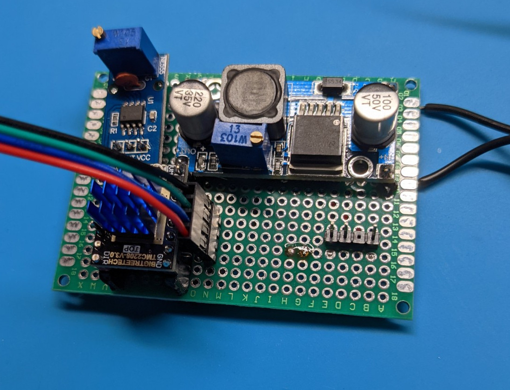

# Spinning moon lamp

https://user-images.githubusercontent.com/3380101/121823841-a0b1da80-cc5c-11eb-8846-c318038572d1.mov

Rotation speed is adjustable.

**UPDATE**: Github just have disabled download of large files from the repo.
Too much traffic for a free account. So STL's might be unavailable.
Here is a snapshot of the repo uploaded to google drive:

https://drive.google.com/uc?id=1VlWB1GTHxwQJGdGt_Hk_-geuGluk5-hF&export=download

## Build guidelines

Start with printing the moon itself.

It is the hardest part and a very long print.

Moon diameter is roughly 260mm. Make sure it fits into your print area.

## Bill of materials

The lamp was designed using widely available off the shelf components.

### Socket cap screws:

* M3x6    x 4  (Motor mount)
* M3x20   x 10 (Main gear to bearing, bearing to light shade)
* M3 nuts x 8  (Main gear to bearing, rack to base)
* M3x25   x 4  (Rack to base)

### Self tapping screws

* M2x6    x 8  (Bottom cover, PCB board to bottom cover)

### Electrical parts

* NEMA17 motor. Any size will fit.
* 12v, 0.5A power supply
* 12v LED strip, 400mm, color temperature 3000-4000K
* Stepper motor driver. I prefer TMC2208 since it's silent.
* 555 timer module ("WINGONEER NE555" on Amazon)
* DC-to-DC converter module based on LM2596
* 70x90mm prototype board ("ELEGOO Double Sided PCB Board" on Amazon)

### Other

* Small zip ties
* Dupont connectors. Optional. You can solder wires directly to the board.
* 24-28 AWG wires ~ 1.5 meters.

### Printed parts

* Moon light shade: PLA+, ESUN, white
* Other parts: ABS+, ESUN, black

**IMPORTANT: Upscale "moon.STL" to 115% in your slicer or mount holes won't match.**

Print settings:

* Nozzile 0.4
* Layer height 0.4
* Layer width 0.4 (Do NOT increase! It will significantly affect quality)
* Infill 100%

## Schematic

PCB

### Electrical adjustments

* Adjust DC-DC converter to 5 volt.
* Adjust 555 timer module using the set screw to make the lamp spin with the desired speed.

## Assembly
The lamp made of 4 main parts and there's absolutely no way to assemble it wrong.

### Rack assemly

Use [photos](/images) for reference.

### Bearing assembly

You have to print about 20 [rollers](STL/roller.stl)

Rollers have shape of truncated cones.
It is important to orient them properly inside the bearing.

**All cone tops should face towards the [inner race](STL/inner_race.stl)**

*Optional* Lubricate the bearing and gears with a plastic-safe grase. Lithium grease will work just fine.

## Credits

* Moon light shade is from [thingiverse](https://www.thingiverse.com/thing:3532973)

* Roller bearing design inspired by [this model](https://www.thingiverse.com/thing:2375124)

* The rest parts are my original design. License: Apache 2.0
